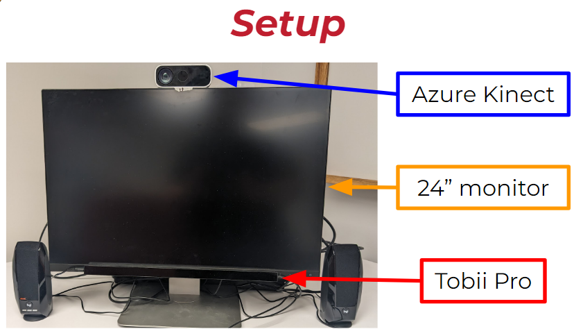
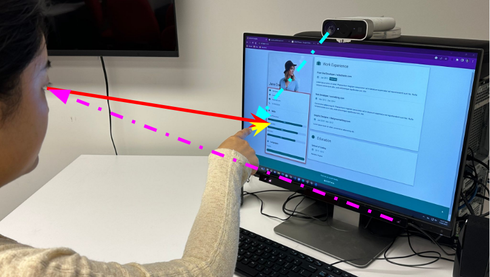
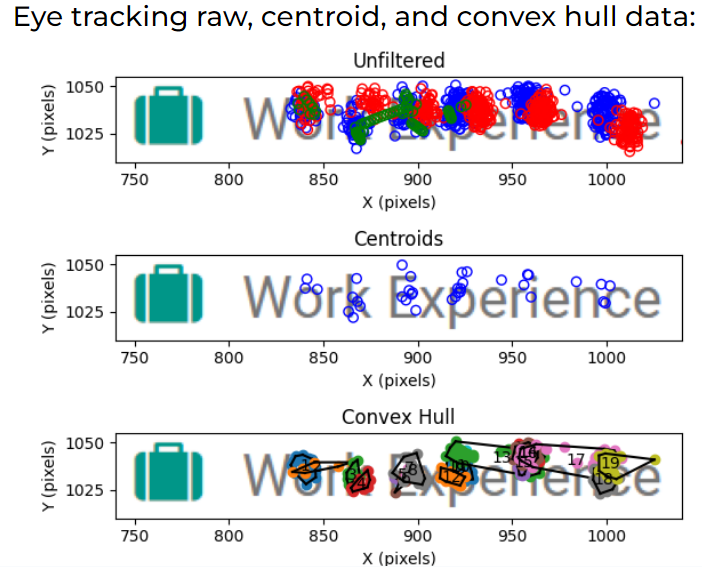

<!-- PROJECT SHIELDS -->
[![LinkedIn][linkedin-shield]][linkedin-url]

<!-- PROJECT LOGO -->
 

  

<h3 align="center">GRACE: Gesture and Gaze Recognition for Accessible Collaborative Environments</h3>

  

    This project is designed to support mixed-ability collaboration between BLV and sighted pairs by conveying information about where someone is referencing on a screen. For example, pointing gestures or saying something like “it’s next to the red box” does not help people who use non-visual ways of accessing information. To solve this problem, we designed a system which will track the gaze and pointing gestures of a sighted collaborator, identify the referenced object (e.g. a paragraph or button), and relay this information to the BLV person’s screen reader. Our goal is to improve collaboration between people of all abilities by improving their communication and reducing their task burden. We also hope to conduct a user study to test the efficacy of our system and add voice recognition. 

  

<!-- TABLE OF CONTENTS -->

  
Table of Contents

  <ol>
    <li>
      <a href="#about-the-project">About The Project</a>
      <ul>
        <li><a href="#built-with">Built With</a></li>
      </ul>
    </li>
    <li>
      <a href="#getting-started">Getting Started</a>
      <ul>
        <li><a href="#prerequisites">Prerequisites</a></li>
        <li><a href="#installation">Installation</a></li>
      </ul>
    </li>
    <li><a href="#contact">Contact</a></li>
    <li><a href="#acknowledgments">Acknowledgments</a></li>
  </ol>

<!-- ABOUT THE PROJECT -->
## About The Project

<!--[![Product Name Screen Shot][product-screenshot]](https://example.com)-->

  This repository contains code designed to obtain and filter gaze data and send that to a website.
  The functions inside the tobiiLive.py file are the most recent versions, tobiiTest was used to develop the eye tracking functions.
  This code contains: data collection, filtering/processing, and visualization functions for the Tobii Pro Fusion eye tracker.
  It is able to calculate centroids live, contains a custom calibration function, and can write data to a csv file afterwards.
  This code contains a Python implementation of the Tobii I-VT Fixation Filter, which is a fixation classification algorithm.
  There is also a sample webpage, web.html, with Javascript designed to handle live data receiving with a Flask server.
  For more information, see the full description at the top of the tobiiLive file.

(<a href="#readme-top">back to top</a>)

### Built With

[![Python][Python.org]][Python-url]

(<a href="#readme-top">back to top</a>)

<!-- GETTING STARTED -->
## Getting Started

This is an example of how you may give instructions on setting up your project locally.

### Prerequisites

This project is built and tested on a Tobii Pro Fusion eye tracker.

### Installation

1. Install the Tobii Pro SDK (tested with v 1.11) [https://developer.tobiipro.com/python/python-sdk-reference-guide.html](https://developer.tobiipro.com/python/python-sdk-reference-guide.html)
2. Install the necessary packages: matplotlib, numpy, Flask (for the server), pygame (for custom calibration).

(<a href="#readme-top">back to top</a>)

<!-- USAGE EXAMPLES -->
## Usage
 This image shows our setup, which includes a 24" monitor, an Azure Kinect camera above the monitor and a Tobii Pro Fusion eye tracker attached to the bottom bezel of the monitor.

 This image shows where the sensors are collecting data using dashed lines (pink coming from the eye tracker to the eye and cyan from the Azure Kinect to the pointing finger). There is a red line representing gaze to the estimated position on the screen and a yellow line representing pointing to the screen. The estimated area of interest is highlighted on the screen in a red box.

 The raw data displayed above has red and blue displaying the calculated positions for each eye and green for interpolated data from the user's dominant eye (the left in this example)/ From this data, centroids were calculated based on the time and position of the eye. The centroid points are averaged from all the points displayed in the convex hull graph.

(<a href="#readme-top">back to top</a>)

<!-- CONTACT -->
## Contact

Juno Bartsch - junobartsch@gmail.com

Project Link: [https://github.com/juno-b/mixed-ability-collab](https://github.com/juno-b/mixed-ability-collab)

(<a href="#readme-top">back to top</a>)

<!-- ACKNOWLEDGMENTS -->
## Acknowledgments
This project would not have been possible without the support and contributions of [Yanzi (Veronica) Lin](https://github.com/yanziv), [Joon Jang](https://github.com/joonbugs), and [Andrew Begel](https://github.com/abegel).

Created at the Carnegie Mellon University [VariAbility Lab](https://github.com/cmu-variability) during the Summer 2023 REUSE program.

(<a href="#readme-top">back to top</a>)

<!-- MARKDOWN LINKS & IMAGES -->
<!-- https://www.markdownguide.org/basic-syntax/#reference-style-links -->
[contributors-shield]: https://img.shields.io/github/contributors/juno-b/mixed-ability-collab.svg?style=for-the-badge
[contributors-url]: https://github.com/juno-b/mixed-ability-collab/graphs/contributors
[linkedin-shield]: https://img.shields.io/badge/-LinkedIn-black.svg?style=for-the-badge&logo=linkedin&colorB=555
[linkedin-url]: https://linkedin.com/in/juno-bartsch-85594a235
[product-screenshot]: images/screenshot.png
[Python.org]: https://img.shields.io/badge/python-3.10-gray?labelColor=3670a0&style=for-the-badge&logo=python&logoColor=ffdd54
[Python-url]: https://www.python.org/downloads/release/python-31011/
