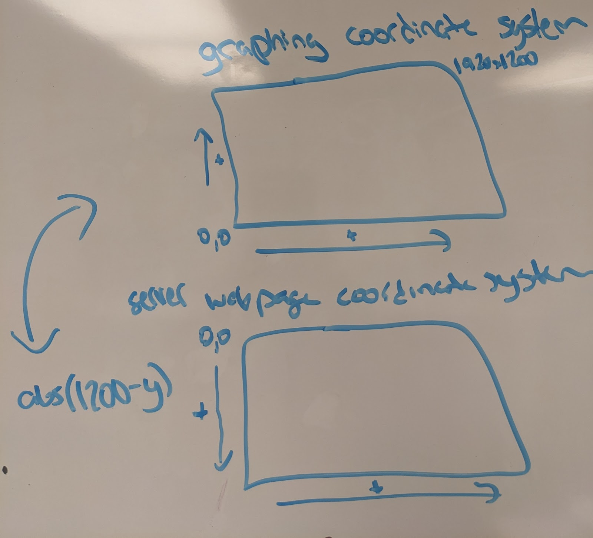

This is a further breakdown from the documentation in the code and readme. The main files you will need are tobiiLive.py and web.html. The tobiiLive file depends on another file to calculate the gaze angle, Point23D.py, which I used from the linked Github.
Note that tobiiTest was used to calculate the eye tracker essentials but does not have live capabilities.

How the code works:

Eye tracker essentials 
Calibration
The eye tracker needs to be properly calibrated to run effectively. I recommend the built-in one with the Tobii Pro Eye Tracker Manager. Make sure to adjust the three dot icon next to “display setup” to ensure the eye tracker is in the right position, then you can calibrate and test the gaze visualization.

This code also contains the start of a custom calibration which we did not end up using. It would probably need a lot more configuration to run correctly. It also requires the pygame package to draw the images. Feel free to use that as a starting point if you need custom calibration. Most of that code is taken from the demos in the Tobii SDK, you can also try looking there!
See calibrate_eyetracker()

Running the eye tracker
duration = number of seconds to run the eye tracker
run_eyetracker(duration)

Linear interpolation
Related functions: check_interpolation, interpolate_gaze_data, linear_interpolation
The check function is used to determine whether interpolation is necessary and is called from the gaze data callback.
The interpolate_gaze_data function calls the linear_interpolation function for all of the necessary data (i.e. the gaze points on the screen, position of the user’s head, etc.)
The linear_interpolation function is a helper function which can run linear interpolation on any one list of 2 or 3 variable arrays such as (x,y) and (x,y,z).

Gaze angle calculation
Once the gaze data is interpolated as needed, it is added to the angle_velocity_deque. This has a maximum length which is the length needed to ensure all centroid points end up in the correct centroid.
find_points_in_window is meant to find the first and last viable point in the window so that the gaze angle can be calculated by gaze_angle_velocity.

Centroid discovery/filtering
Centroid data is held in a custom class which contains an id list of included points, start and end times, x and y lists of included points, origin, topmost dom object (tdo) and area of interest (aoi). Centroids are found from the find_centroids function and converted to CentroidData objects in the gaze_tuple_to_centroid_data function. However, these points are messy and often added multiple times. I tried to fix this with filter_centroids. This worked really well in the non-live version but as you run this, you may see errors like the points not being added in order or being placed into different centroids. For example, 2-5 could be a centroid followed by 1, 1. This didn’t seem to impact usability too much but could definitely be a place to debug. 

You’ll also notice by plotting the live centroids that they don’t always appear to behave as expected. I did not have the time to properly debug this and it hasn’t caused too many issues with usability so far.

Non-eyetracking functions/notes
Global variables
Be sure to adjust the dominant eye, screen height and width based on your monitor and user. Andrew asked us to use the dominant eye rather than an average, which you can calculate using something like this: https://www.allaboutvision.com/resources/dominant-eye-test.htm 

I have a lot of variables from different iterations of this code and it’s possible I may have left some unused ones there by accident. You can ctrl/command f them to see where they’re used.

Plots
I have a function which calls all the plots I want to use on a particular run. Note that these are not configured to run live so they should be called after the fact.

Draw_pixels and update are used to draw an animated (looks live) plot. I also have functions for a standard graph, graph with two sets of coordinates, the unfiltered/raw data graph, and convex hulls.

CSV
I recommend calling this last. I’m going to describe what all the variables mean and the units to the best of my knowledge. Note that any columns you add need to be manually added to the write_to_csv function to avoid errors.

Output.csv
Times are in microseconds since the eye tracker/machine have been restarted, most of my code uses the device timestamp.
Left, right, inter gaze on display area: points in the graphing coordinate system
Points in user/ trackbox coordinate systems described in the “coordinate systems” section
Validity: 0 if invalid, 1 if valid; pupil diameter: unused

Custom columns created in addition to the standard Tobii output:
Selected eye: none if no data, inter if interpolated, the dominant eye otherwise
User distance from the screen in millimeters is the third value in origin
Index: of current point, window_1 and 2 are the relevant first and last points in the window for gaze angle calculation if they exist
angular_distance and velocity calculated by the gaze angle
Interpolated data has similar columns as I found them useful including point on display area, origin in user/trackbox coordinate systems, and origin validity.

Centroids.csv
Lists the columns as described by CentroidData
x_avg and y_avg are the average points from the x/y lists using the coords function

AOIs
This was an effort to determine whether the points could be classified as part of larger areas of interest, like the big boxes and taskbar. The AOIs are manually defined in check_in_bounds.

Server
The server is used to communicate eye tracking data to the website. Currently, it is not able to run concurrently with the eye tracker.

Steps:
Flip any data sent to the server using the flip_y function so that it can be graphed appropriately
To host the website, you can use python -m http.server
To run the flask server you can run the serv4 function. 1-3 were different iterations I was trying to overcome CORS issues. The flask server doesn’t seem to like being threaded.

Web.html
The HTML was taken from a w3schools demo site and I removed some stuff to make it fit nice on the screen. I added scripts to get eye tracking data and an interval to run it on, adjust it as needed. There’s also a drawBorderAroundElement function which gets the topmost dom element at a location and draws a bright red box around it.

Coordinate Systems
There are quite a few coordinate systems in use in this project. From the eye tracker there is the UCS and TBCS. You can read about them here:
https://developer.tobiipro.com/commonconcepts/coordinatesystems.html 
I also describe the “graphing” and “server/webpage” coordinate systems in this sketch.

Basically, to plot anything on the webpage, the origin needs to be the top left of the monitor, but for it to make sense to us graphically, the y direction needs to be flipped (the origin would be the bottom left corner of the monitor). You can convert between the two by taking the absolute value of the screen height minus your coordinate.

Please feel free to contact me if you have any issues/questions @ junobartsch@gmail.com 